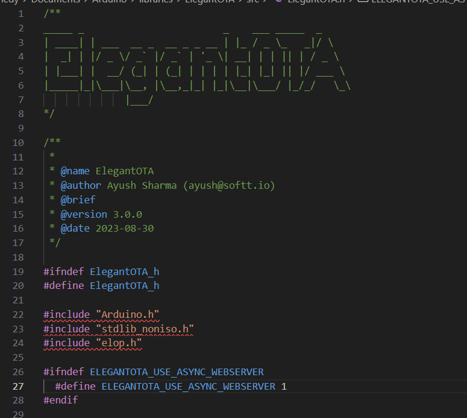

# North Carolina Arboretum Light Show Project 2024

This project was designed for an interactive light show at the North Carolina Arboretum with [William Kennedy!](https://freakylamps.com/)  

> **Note**: This software is designed around a custom open-source PCB designed by Will Kennedy.  
> - The design files for the PCB can be found [here](link PCB schematics here).  
> - There is also a custom hardware electronics box and TOF sensor mount, both designed by Will Kennedy. You can find those designs [here](link here).

The TOF sensors are configured to detect when a handrail is touched and measure the distance relative to the edges of the rails. These signals are transmitted over Art-Net (DMX over Ethernet) to a program called [Lightjams](https://lightjams.com).

Lightjams processes the DMX data to control surrounding lighting fixtures by sending out its own Art-Net frames. The result is an interactive experience where visitors can influence the lighting simply by touching the rails.

# Hardware Requirements
- **ESP32**: The microcontroller used to handle both sensor data and control the NeoPixel strips.
- **2x VL53L1X TOF Sensors**: Measures distance at which hand is touching a handrail from the edge.
- **Adafruit NeoPixel Strips**: Addressable RGB LED strips that create the light effects.
- **William K's Open-Source PCB**: Takes 24V input, pases it through a fuse, and outputs power to LED strips, also does 5V to 3.3V logic level shifting and provides power to ESP32, takes in ToF Sensors
  
# Wiring
## ESP32 Pinout
- GPIO 2 = LED output (goes to all 4 led strips)
- GPIO 13 = XSHUT1 (for ToF Sensor 1)
- GPIO 16 = XSHUT2 (for ToF Sensor 2)
- GPIO 21 = SDA (for I2C VL53L1X TOF sensors)
- GPIO 22  = SCL (for I2C VL53L1X TOF sensors)

# Debug modes
In the Serial Monitor there are several commmands and special funcitons
- q = restart ESP
- p = getHTMLParameterValues
- h = printHowManyHands
- d = print distances
- a = display ArtNet data
- f = useFilter 
- n =  new_weight = Serial.parseFloat();
      Serial.print("Received float value: ");
      Serial.println(new_weight);
- o  = old_weight = Serial.parseFloat();
      Serial.print("Received float value: ");
      Serial.println(old_weight);
- c = display parsed data
- t = toggle two hand effect

# Software Requirements
- **Arduino IDE** with ESP32 board support.
- Libraries:
  - [Adafruit VL53L1X Library](https://github.com/adafruit/Adafruit_VL53L1X)
  - [Adafruit NeoPixel Library](https://github.com/adafruit/Adafruit_NeoPixel)
  - [Wire Library](https://www.arduino.cc/en/reference/wire) (for I2C communication with TOF sensors)
  - [WiFi.h](https://www.arduino.cc/en/Reference/WiFi): For Wi-Fi functionality with the ESP32.
  - [ESP Async Web Server Library](https://github.com/mathieucarbou/ESPAsyncWebServer): For asynchronous web server operations.
  - [Async TCP](https://github.com/mathieucarbou/AsyncTCP)
  - [ArtnetWifi.h](https://github.com/rstephan/ArtnetWifi): For Art-Net DMX control over Wi-Fi.
  - [SparkFun_VL53L1X.h](https://github.com/sparkfun/SparkFun_VL53L1X_Arduino_Library): To interface with the VL53L1X TOF sensor.
  - [Elegant OTA](https://github.com/ayushsharma82/ElegantOTA): To send Over-The-Air firmware updates to ESP32. 
      - MODIFICATION NEEDED to ElegantOTA.h file:
       (typically found in Docuemnts/Arduino/Librarys/ElegantOTA/src)
   - MAKE SURE YOU change line 27 to be:
   `#define ELEGANTOTA_USE_ASYNC_WEBSERVER 1` the default value is 0 
  - **math.h**: For mathematical operations.

# Installation

1. **Clone the repository**:   
   git clone https://github.com/EliseoNunezVega/ArboretumWinterLights2024.git

2. **Install Libraries**:
   - Open the Arduino IDE.
   - Navigate to \`Sketch -> Include Library -> Manage Libraries\`.
   - Search for and install the following libraries:
     - Adafruit VL53L1X
     - Adafruit NeoPixel
     - ESPAsyncWebServer
     - SparkFun VL53L1X
     - ArtnetWifi

3. Add LightJams steps 

# Usage
## Over The Air firmware updates to ESP32
This is Done via [Elegant OTA](https://github.com/ayushsharma82/ElegantOTA)

STEPS
1. be on the same network as the ESP32 you want to update
2. find the IP address of the ESP32 you want to update (via the router admin page)
3. compile the firmware to a binary file (.bin). 2 ways to do this: 
      1. In Arduino IDE: Sketch -> Export Compiled Binary (or Alt-Cntl-S). The binary will be in the "build" folder inside the sketch folder 
      2. In Arduino IDE, Turn on VERBOSE reporting for Upload. Then Compile. 
      - look for a line like:
       `avrdude: reading input file  C:\Users\Bob2\AppData\Local\Temp\arduino_build_586883/sketch_may05b.ino.hex"`
4. Go to web broswer. enter `your.id.address.of.esp32/update`
5. upload .bin file! 

## License
This project is open-source under the MIT License. Feel free to modify and expand upon it.
